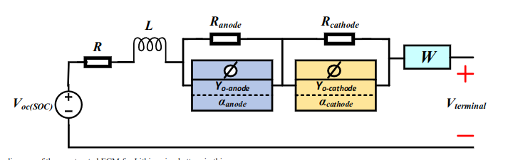
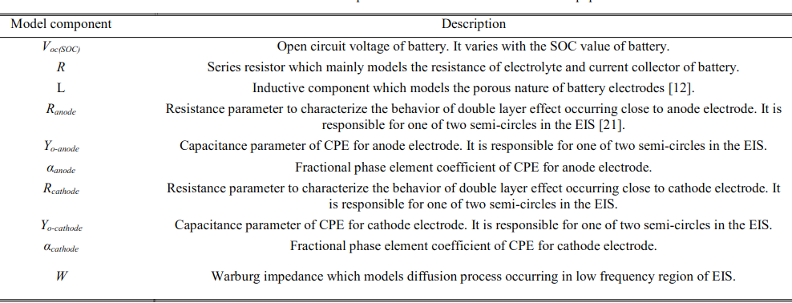
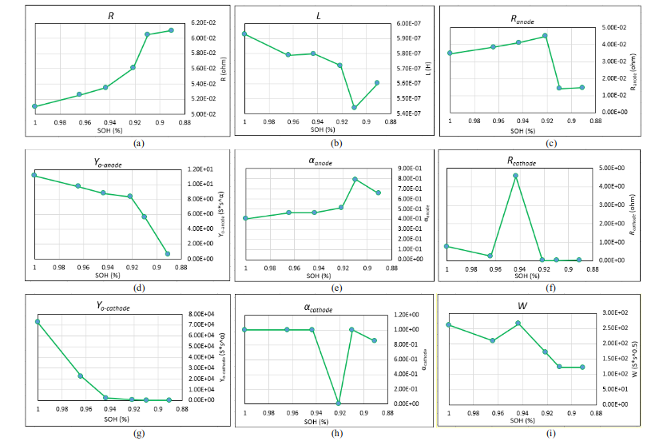
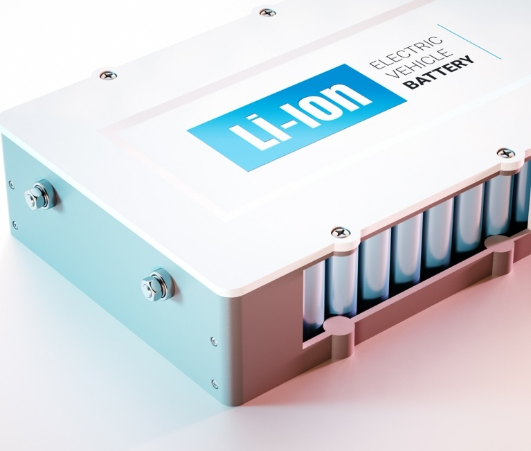
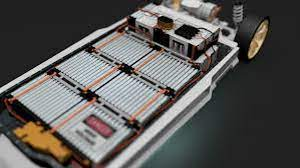

# State of Health Estimation of LMO/NMC-based Electric Vehicle Lithium-Ion Batteries Using the Incremental Capacity Analysis Technique

## ABSTRACT
The implementation of an **accurate but also low computation** demanding SOH estimation algorithm represents **a key challenge** for the BMS in EV applications. In this paper we investigate the suitability of the **incremental capacity analysis (ICA) technique** for **estimating** the **capacity fade** and subsequently the **SOH** of **LMO/NMC-based EV Lithium-ion batteries**. Based on **ageing results** collected during **eleven months of testing**, we were able to **accurately relate the capacity fade of the studied batteries to the evolution of the voltage value**, which corresponds to one of the incremental capacity **(IC) valleys**, obtained using the ICA technique.

## REFERENCES
[1] D.-I. Stroe et al., “Accelerated Lifetime testing methodology for Lifetime Estimation of Lithium-Ion batteries Used in Augmented Wind Power Plants,” IEEE Transactions on Industry Applications, vol. 50, no. 6, pp. 4006-4017, Apr. 2014.

[2] W. Waag, C. Fleischer, D.U. Sauer, “Critical review of the methods for monitoring of lithium-ion batteries in electric and hybrid vehicles,” Journal of Power Sources, vol. 258, pp. 321-339, 2014.

[3] M. Berecibar et al., “Critical review of state of health estimation methods of Li-ion batteries for real applications,” Renewable and Sustainable Energy Reviews, vol. 56, pp. 572-587, 2016.

[4] J. Groot, “State-of-Health Estimation of Li-ion Batteries: Ageing Models,” Ph.D. Thesis, Chalmers University of Technology, Göteborg, 2014.

[5] C. Weng, et al, “On-board state of health monitoring of lithium-ion batteries using incremental capacity analysis with support vector regression,” Journal of Power Sources, vol. 235, pp. 36-44, 2013.

[6] M. Dubarry, V. Svoboda, R. Hwu, B. Y. Liaw, “Incremental Capacity Analysis and Close-to-Equilibrium OCV Measurements to Quantify Capacity Fade in Commercial Rechargeable Lithium Batteries,” Electrochemical and Solid-State Letters, vol. 9, no.10, pp. A454- A457, 2006.

[7] A. Eddahech et al., “Remaining useful life prediction of lithium batteries in calendar ageing for automotive applications,” Microelectronics Reliability, vol. 52, pp. 2438-2442, Sep. 2012.

[8] M. Swierczynski et al., “Suitability of the Nanophosphate LiFePO4/C Battery Chemistry for the Fully Electric Vehicle: Lifetime Perspective,” IEEE Transactions on Industry Applications, vol. 51, no. 4, pp. 1-8, Mar. 2014.

[9] A. I. Stan et al., “A Comparative Study of Lithium Ion to Lead Acid Batteries for use in UPS Applications,” in IEEE 2014 International Telecommunications Energy Conference, 2014, pp. 1-8.

[10] S. Käbitz et al., “Cycle and calendar life study on a graphite/ LiNi1/3Mn1/3Co1/3O2 high energy system. Part A: Full cell characterization,” Journal of Power Sources, vol. 239, pp. 572-583, 2013.

[11] P. Keil and A. Jossen, “Calendar Aging of NCA Lithium-Ion Batteries Investigated by Differential Voltage Analysis and Coulomb Tracking,” Journal of The Electrochemical Society, vol. 164, no. 1, pp. A6066-A6074, 2017.

# BEEP: A Python library for Battery Evaluation and Early Prediction

## Abstract
Battery evaluation and early prediction software package (BEEP) provides an open-source Python-based framework for the **management and processing of high-throughput battery cycling data-streams**. BEEPs features include file-system based organization of raw **cycling data** and **metadata** received from **cell testing equipment**, **validation protocols** that **ensure** the **integrity** of such data, **parsing and structuring of data into Python-objects ready for analytics**, **featurization of structured cycling data to serve** as input for machine-learning, and end-to-end examples that use processed data for **anomaly detection** and **featurized data** to **train early-prediction models for cycle life**. BEEP is developed in response to the software and expertise gap between **cell-level battery testing** and **data-driven battery development**.

## Keywords
Battery, **Cycling experiments**, Python, Data management, Machine-learning

# Synopsis Article on What is a Battery Management System?

Battery Management System(BMS) is a tech dedicated to the **supervision** of a **battery pack**, which is an assembly of battery cells, electrically organized in a row X column matrix configuration to **enable delivery** of **targeted range** of **voltage and current** for a **duration of time** against expected load scenarios.

The Oversight that a BMS provides usually includes:
	1. Monitoring the battery pack
	2. Provide protection to battery pack
	3. Estimating the battery pack's operational state
	4. Continually optimizing performance of battery pack
	5. Reporting Operational Status to external devices
	
Lithium-Ion rechargeable cells have the highest energy density and the standard choice for battery packs for many consumer products

While they perform superbly, can wreak havoc, if operated outside of a, generally tight **safe operating area(SOA)** with outcomes ranging from **Compromising the battery performance** to outright **dangerous consequences**.

BMS certainly has a challenging job description, and it's overall complexity and oversight outreach may span many disciplines such as electrical, digital, control, thermal and hydraulic

## How do battery management systems work?

Battery management systems **do not** have a **fixed or unique set of criteria** that must be adopted. The technology design scope and implemented features generally correlate with:

The **costs, complexity, and size of the battery pack
Application of the battery and any safety, lifespan, and warranty concerns**

**Certification requirements** from **various government regulations** where **costs** and **penalties** are paramount if inadequate functional safety measures are in place

There are many BMS design features, with **battery pack protection management** and **capacity management** being two essential features. 

**Battery pack protection management has two key arenas**: **electrical protection**, which implies **not allowing the battery to be damaged via usage outside its SOA**, and **thermal protection**, which **involves passive and/or active temperature control to maintain or bring the pack into its SOA**

# Incremental Capacity Analysis as a State of Health Estimation Method for Lithium-Ion Battery Modules with Series-Connected Cells
# Design and Development of Solar Charging System for Electric Vehicles: An Initiative to Achieve Green Campus

## ABSTRACT
Renewable energy is a kind of energy that is obtained through different resources such as **sunlight**, **wind energy**, **tides**, **geothermal** etc. It provides **clean energy** that comes from **natural sources** which can be **replenished continuously**. The utilization of more amount of renewable energy will **lower the prices of and demand for fossil fuels**. **Solar photovoltaic energy** is predominantly used for many applications like **heating**, **cooking** and **power generation**. Recent inventions helped in developing vehicles that are driven by solar energy. In this paper, **the design and development of a solar charging system for electric vehicles using a charge controller is discussed**. Implementation of the proposed system will reduce the electricity cost and charging and discharging losses. Also, the proposed solar charging system will be one of the initiatives taken to achieve Green campus. This paper will demonstrate the system design and performance analysis of a solar-charged electrical vehicle system.

## INTRODUCTION
The demand for energy is increasing due to the increase in population and the economic conditions of many countries. Recent research works reported that fossil fuels have **limitations such as global warming, limited resources and economical issues**. The **energy crisis is expected in the near future** and the **utilization of renewable energy is to be explored to the maximum possible extent to overcome the problems that arise out from fossil fuels**. Many researchers suggested the use of renewable energies considering many environmental aspects. Renewable energy such as solar energy can be an effective alternative in terms of its availability, cost-effectiveness and environmental friendliness.

## CONCLUSION AND FUTURE SCOPE
The **development of the Solar Charging system for electrical vehicles** project comprised of various disciplines like electrical, electronics, and mechanical engineering technologies. This paper attempted to provide a framework for the design and development of a solar charging system which would provide an opportunity for the students to learn the theoretical aspects and hands-on experience of **utilizing solar energy**. The **proposed solar charging system will be one of the initiatives taken to achieve a Green campus**. The design considerations and calculation for various components are presented in detail. The **economic analysis** of the proposed system reveals that the **payback period** of the project is _3.5 years_. It is clearly evident from Table 3 that the **proposed solar-based vehicle charging system is better than the existing electrical charging system** both in terms of **operation and economical aspects**. Researchers work on this project get a basic idea of the design and building of Solar PV systems for several useful applications such as **electrical vehicle system**.

Based on the proposed project, many new works will be developed to design an efficient system for further applications. The performance analysis of the solar-charged vehicle system will be carried out to enhance the efficiency of the **pilot project**. As a measure to **reduce the carbon footprint** to achieve energy sustainability, this project will be further enhanced. In addition to this solar charging system, an effort will be made to operate all battery-operated vehicles available on the campus to utilize solar energy by establishing more charging stations. This initiative will encourage energy sustainability on campus and inspire the various stakeholders such as students, faculty and staff to use public transportation and electric vehicles that are charged by solar energy.

## REFERENCES
Capasso, C. and Veneri O. 2015. Experimental study of a DC charging station for full electric and plug in hybrid vehicles. J. Applied Energy, 152: 131-42.

Chandra Mouli, G.R., Bauer, P. and Zeman, M. 2016. System design for a solar powered electric vehicle charging station for workplaces. J. Applied Energy, 168(15): 434-443. doi.org/10.1016/j.apenergy.2016.01.110.

Choe, G.Y., Kim, J.S. and Lee, B.K. 2010. A Bi-directional battery charger for electric vehicles using photovoltaic PCS systems. In: IEEE Vehicle

Power Propuls Conf., IEEE, pp. 1-6. Fattori, F., Anglani N. and Muliere G. 2014. Combining photovoltaic

energy with electric vehicles, smart charging and vehicle-to-grid. J.
Solar Energy, 110: 438-51.
Goli, P. and Shireen, W. 2014. PV powered smart charging station for
PHEVs. J. Renewable Energy, 66: 280-7.
Mesentean, S., Feucht, W., Mittnacht, A. and Frank, H. 2011. Scheduling
methods for smart charging of electric bikes from a grid-connected
photovoltaic-system. In: UKSim 5th Eur Symp Computer Modeling
Simulation, IEEE; p. 299-304.
Singh, M., Thirugnanam, K., Kumar, P. and Kar, I. 2015. Real-time
coordination of electric vehicles to support the grid at the distribution
substation level. J. IEEE Syst., 9: 1000-10. doi.org/10.1109/
JSYST.2013.2280821.
Thirugnanam, K., Ezhil Reena, JTP., Singh, M. and Kumar, P. 2014.
Mathematical modelling of Li-ion battery using genetic algorithm
approach for V2G applications. IEEE Trans. Energy Convers., 29:
332-43

# Computer modelling of electrical power systems

Electrical power systems

What the hell is a **steady and dynamic** state of electrical power systems?

Prereqs

- power system theory
- matrix analysis
- neumerical techniques

computational and transmission system developments
**FACTS** & **HVDC** links
General purpose single phase load flow program

Neuton fast decoupled algorithm
power system in dynamic states
electronagmetic transients with reference to the EMPT method
power electronic components
electromechanical models

## Chapter-1(Introduction)

**FORTRAN** based power system computer progarams implemented to run on mainframes

**HVDC && FACTS technologies**
_modern power transmission and distribution systems are A.C. right?_

EMTP -> Electro Magnetic Transient Programs
RTDS -> Real Time Digital Simulation

- **HIGH VOLTAGE DIRECT CURRENT** => HVDC
- **FLEXIBLE ALTERNATING CURRENT TRANSMISSION SYSTEMS** => FACTS

Okay, I'm looking to gain understanding on Battery Management Systems
Current book that I'm reading is **Computer Modelling of Electrical Power Systems**
You have to stop reading this book because

1. It doesn't have any thing on BMS
2. It contains topics on **Load Flow** and **Transmission Systems Modelling**
3. It contains topics like **FACTS** & **HVDC** transmission, which, Right now, I don't give a flying fuck.

# Evaluation of Electrical Circuit Model Parameter variations under different state-of-health conditions for Litihium-ion battery.

- ECM parameter variation
- different state-of-health conditions

## keywords
ageing, capacity fade, EIS

# Questions

## what are computationally economical methods for determining SoH of a BMS which are Accurate as well?

First of all, State of Health is not a term related to BMS. BMS computes the **State of Health** for a **battery pack**. **State of Health is a property of a battery pack** like this one

Or, this one

 
Now, the question is, what are the algorithms to BMS uses to calculate State of Health of a battery pack?
### What are the most common methods used for determining SoH of a BMS?

### How can we use such methods to determing SoH of a BMS for a real world EV?

### Okay, ICA(Incremental Capacity Analysis) is a method for determining SoH, which is, both, computationally economical as well as pretty much accurate?

### ICA can further be used for **Capacity Fade**?

### What the hell is capacity fade anyway?

### What are the most common types of batteries used in Modern EVs? In the paper which I'm reading, they discussed LMO and NMC based batteries

### What are ageing results?

### What are capacity fade of a battery?
